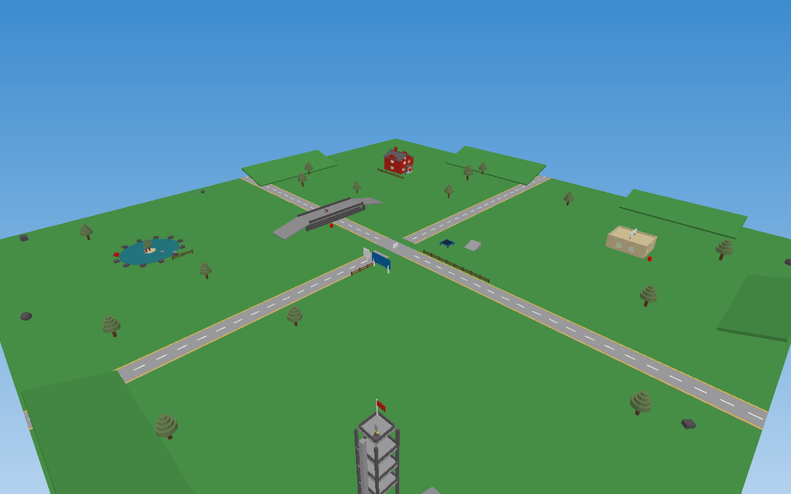

# Crossroads (2007) — a classic Roblox rebuild



A fan-made, brick-by-brick recreation of the classic **2007 Roblox "Crossroads"** map —
built the way builders made things back then: **plain Parts, Wedges, Cylinders and Balls.
No meshes, no unions, no CSG, no terrain, no PBR.**

The finished game is one file: **[`Crossroads.rbxlx`](Crossroads.rbxlx)**.

## 🌐 Live demo site (GitHub Pages)

**https://gefrus112.github.io/crossroads-2007/** — walk around the map in your browser
(rendered from the same data as the place file), browse screenshots & the map guide,
and download the place.

## ▶ Play it in Roblox

1. Download [`Crossroads.rbxlx`](Crossroads.rbxlx).
2. Open **Roblox Studio** → **File → Open…** → pick the file.
3. Press **Play (F5)** to test. You spawn on the white pad at the crossroads.
4. **File → Publish to Roblox As…** → name it `Crossroads` → set it **Public**. Done.

## 🗺️ What's in the map

| Landmark | Notes |
| --- | --- |
| **Spawn pad** | Classic white swirl pad, dead center of the crossroads |
| **Welcome sign** | "Welcome to ROBLOX!" billboard + classic logo board |
| **Two grey roads** | Cross/plus intersection, white dashed center lines, yellow edge lines |
| **Stone bridge** | Slate-grey stepped corbel arch over the road, railings, ramps — **Rocket Launcher** on deck |
| **Red brick house** | Two stories, glass windows, door, furniture, spiral stairs, porch, mailbox — **Sword** on the porch |
| **Corner shop** | Tan/beige flat-roof building with rooftop sign and crates |
| **Lake** | Classic blue water disk, island pine, stepping stones — **Rocket Launcher #2** |
| **Watchtower** | 3 decks + roof, truss ladder, red flag — **Sword #2** on top |
| **Trampoline** | 120-stud bounce next to spawn |
| **Props** | Traffic cones, explosive red barrels (they chain!), fences, skate ramps, slate rocks, hills |
| **Trees** | Classic pines: brown cylinder trunk + green disc leaves |

## 🕹️ Gameplay

- Free roam, default camera and movement, no forced tools
- Touch a tool on its grey pad to pick it up (tools respawn after 25 s)
- **Classic Sword** — click to slash, lunges you forward, old `swordslash.wav` / `unsheath.wav`
- **Rocket Launcher** — rockets fly straight, break joints, 7-second reload
- **Red barrels** explode when hit hard (rockets chain them)
- Classic-style leaderboard: **KOs** and **Wipeouts**, 5-second respawns
- Default Roblox chat and UI only — nothing custom on screen

## 🧱 Period-correct details

- **Lighting:** Legacy technology, global shadows off, `Ambient` raised, 2:00 PM
- **Sky:** the classic `sky512` blue-sky / white-clouds skybox (pinned explicitly)
- **Materials:** Plastic + Slate only; studded top surfaces (old-school "bricks")
- **Palette:** the original BrickColor ints (Bright green `141`, Medium stone grey `194`, …)
- **No** ProximityPrompts, **no** StreamingEnabled, **no** modern camera/UI overrides
- Every part is anchored; only tool pickups are physical

## 🔨 Rebuilding / hacking on the map

The place is generated from code — the generator is the source of truth (single
scene model → both the `.rbxlx` and the web preview data):

```bash
node tools/generate-place.mjs   # writes Crossroads.rbxlx + assets/map.json
node tools/render-shots.mjs     # writes assets/img/*.png + map-topdown.svg (uses `npm i pngjs`)
```

```
Crossroads.rbxlx          # the game (XML place file — open in Studio)
tools/generate-place.mjs  # scene definition + rbxlx writer
tools/render-shots.mjs    # tiny software renderer for screenshots
index.html                # GitHub Pages site
assets/                   # preview.js, style.css, map.json, img/
```

## 📌 Notes & honest limitations

- Modern Roblox requires `FilteringEnabled`; classic no-filtering tool behavior is
  recreated inside the tool scripts (they behave exactly like the old ones).
- Spawn/logo decals use classic re-uploaded image IDs (`12224170`, `743461071`);
  if one ever stops resolving, swap the ID in `tools/generate-place.mjs` and rebuild.
- Character/camera are platform defaults, so minor modern behaviors (jump sound,
  avatar scaling) still come from the platform itself.
- Lighting is set to Legacy; current Studio may coerce it to Compatibility — visually identical for this build.

## ⚖️ Disclaimer

Fan project made for nostalgia. Not affiliated with, endorsed by, or sponsored by
Roblox Corporation. ROBLOX and Roblox are trademarks of Roblox Corporation.
